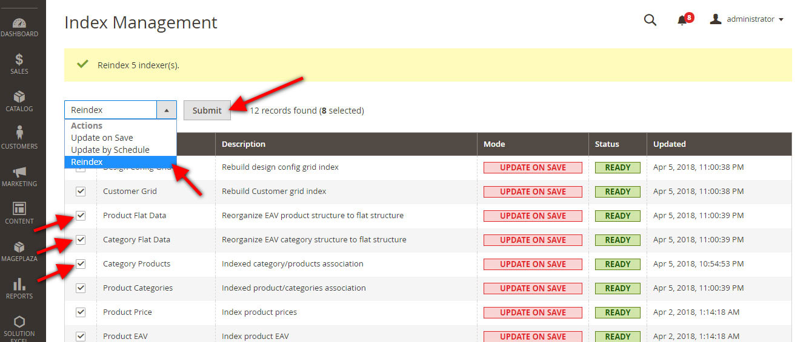

# Magento 2 Reindex Extension (free)
Magento 2 reindex single or multiple Indexer from admin panel, without command line.

Reindex your Magento 2 store quickly and easily from admin. Do not used it in large production environment If you think mysql server not able to execute indexing execution completely.

## Compatible With:
Magento ver 2.2.2

## Available Features:
* Multiple or Single indexer can execute from backend/admin.
* Admin user able to reindex without command line.
* Menu: SYSTEM => Tools => Index Management

## Reindex Multiple or Single indexer from index management gird

## Installation
##### Manually (not recommended)
 * Download Reindex Extension
 * Unzip the magento2-reindex-master.zip file
 * Create a folder {Magento 2 root}/app/code/Solutionexcel/Reindex
 * Copy all files and folder to Reindex folder

#### Step 2 - Enable/Install via command line
 * php bin/magento module:enable Solutionexcel_Reindex
 * php bin/magento setup:upgrade
 * php bin/magento cache:flush

If you have any inquiry please contact with me via email or skype.
* Email: [info@solutionexcel.com](mailto:info@solutionexcel.com)
* Skype: solutionexcel
* Web: [Solution Excel](https://www.solutionexcel.com/)
